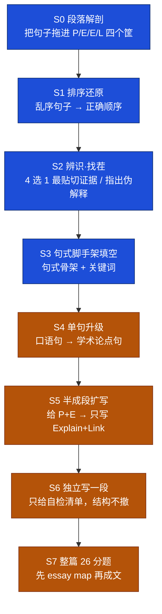

# 写作练习（学术论文写作训练）· 方案

> **状态**：设计稿 + 取证器已实现（`app/scripts/writing-label-evidence.mjs`）；**未动产品代码**。
> **日期**：2026-09-15
> **性质**：本文是讨论结论的存档。重点记录**为什么这么定**、**哪些路已被实测否掉**（防重走）、以及**实测数字**（避免重跑）。
> **相关**：`课程化备忘.md`（写作练习＝独立新建体系）、`定义题方案.md`（要素化判分 + 抽检闭环）、`逻辑关系与应用.md`（conceptGraph 归组）、`模拟调研方案.md`（附录 B 批判审查者）、`知识库AI问答方案.md`（`skill_*` 语料）、`OCR辅助阅卷.md`（教师批改承接）

---

## 一、目标与两条前提校正

### 1.1 目标

把 **PEEL 段落工艺**与本考纲的 **「3 正 3 反」论文骨架**，做成学生可以**反复练**的阶梯，前期完全不动笔（识别 / 排序 / 选择），逐级过渡到独立成篇。

### 1.2 前提校正（2026-09-15，教师口径，重要）

初期设计曾从 KS3/GCSE 英语科的教学争论（Alex Quigley 引 AQA 2024 考官报告）引入「**支架必须撤除**」这条主线，据此把"撤掉 PEEL"当作阶梯终点。**此前提已作废**，理由：

> 那套争论成立的前提是"学生已经写得很顺、缩写开始限制创造力"。对本项目面对的学生群体，**PEEL 是底线而非过渡，绝大多数学生走不到"撤除"这一步**。

由此确定：

1. **本方案不设"撤支架阶段"**。S6/S7 是"只给自检清单、结构不撤"，不是"把结构拿掉"。
2. 阶梯的价值**不在爬得高，而在底层几级的重复次数**（S0–S3 零 AI、可自动判分，越底层越值钱）。
3. 对少数愿意自由发挥的学生，可另设可选高阶形式，**不进主线**。

### 1.3 AO 与段落结构的对应（教师口径）

| 项 | 口径 |
|---|---|
| **段落模板** | **纯 PEEL 四动作**（Point → Evidence → Explain → Link）。**段内不含"评估"动作。** |
| **AO1 / AO2** | 贯穿全篇 |
| **AO3** | **由"反方段"整体承担**；一篇 26 分论文通常 **3 正 + 3 反**，那 3 个反方段每一个都是完整的一套 PEEL |
| 引言 / 结论 | 有，但**不专项练习** |
| 正↔反关系 | **最优解是正反段一一对位**；做不到时，**只要与该题 evaluate 的 statement 构成评估关系即可**（允许"三个角度反同一立场"） |

> 教科书侧的口径与此一致：`9699textbook1/ch09` 的 strong answer 清单为「定义 → 分正反 → 每段挂理论/研究 → 平衡结论」；ms 蒸馏每章也按「支持方证据链 / 反方弹药 / 高分收尾」分栏。
> 推论：**段落级练习不需要分正反两套**（工艺同构），但**语料必须正反各半**，否则学生会形成"PEEL 是写支持用的"的错误直觉。

---

## 二、形态阶梯



**蓝 = 判分型**（有唯一/可规则判定的答案，零 AI，可走 `recordItem` → 掌握度 + 打卡）；**橙 = 完成型**（主观，需 AI 点检 / 同伴 / 教师，需要新的"完成事件"模型）。

| 级 | 任务形态 | 判分 | 关键作用 |
|---|---|---|---|
| **S0** | 给一段教师认可的范文，把句子拖进 P/E/E/L 四个筐 | 唯一答案，纯离线 | 建立"段落可拆"的直觉 |
| **S1** | 乱序句子 → 还原顺序（4–6 句） | 唯一答案，纯离线 | 结构顺序感 |
| **S2** | ① 同一 Point 下 4 个候选 Evidence 选最贴切的；② 指出哪段的 Explanation 只是复述证据 | 唯一答案，纯离线 | 直击 AO2 最常失分处：证据不贴题、解释＝复述 |
| **S3** | 句式填空：`___ would argue that ___` / `This is supported by ___ (year), which found ___` / `However, ___ would criticise this, arguing ___` | 规则粗判（理论名/年份是否出现）+ 后续 AI | 从"认得出"到"写得出"；**句式库直接复用 `skill_scaffolds`** |
| **S4** | 给一句大白话 → 改写成带理论名的论点句 | 要素覆盖（术语用上了吗、有无因果/评价动词） | 学术语域；复用定义题的要素化判分 |
| **S5** | 给 P + E，只写缺的 Explain + Link | AI 点检 / 教师 | 局部受控写作，写作量最小 |
| **S6** | 独立写一段，顶部只给**自检清单**（有理论名？讲了机制？回到问题了吗？） | 完成型 + AI 点检 + 同伴互评 | **AI 从这一级才开始介入** |
| **S7** | 26 分题：先 essay map（引言 / 3 正 / 3 反 / 结论），再写正文 | 完成型；AI 按 AO 量规给分项反馈；**手写稿可走已有 OCR 辅助阅卷** | 与教师批改链路对接 |

### 2.1 论文层轨道（与段落层并行、范式对称）

段落层只教"工艺"，学生真正的崩点在论文层：**拿到 evaluate 题不知道该找 3 个正、3 个反**，或找出的 3 反在重复打同一点。故补一条论文层轨道，**复用同一套"零动笔"低成本范式**：

| 能力 | 段落级 | 论文级 |
|---|---|---|
| 识别 | 句子 → P/E/E/L 筐 | **段落 → 「正 / 反」两筐**（**必须先给题干**；侧别是相对的，见 §5.7） |
| 排序 | 乱序句子还原顺序 | **乱序段落还原顺序** |
| 对位 | 4 选 1 最贴切证据 | **正↔反对位**：给 3 正 + 3 反，指出哪一反打的是哪一正 |
| 补全 | 给 P+E 写 Explain+Link | **给 3 正 2 反，补出缺的那个反方段**（最接近考场） |
| 成篇 | 独立写一段 | 独立写全篇（先 essay map） |
| **换题干翻转** | — | **同一段材料，换一个题干 → 侧别翻转**（见 §5.7，训练"论点服务于题干"） |
| **双面引用** | — | 给一个词条（如 `Domestic violence`、陪产假政策），问"它在支持该观点的论文里怎么用？在反对的论文里怎么用？"（17 个同章双面案例即现成题库） |

**「正↔反对位」价值最高**，因为 ms 蒸馏反复给分在此：

> "高分关键在于「内部相互评估」：一种解释的强项恰是另一种的软肋……**能画出这张互评图即 AO3**。"（`9699papers-ms/chapters/P1-deviance-explanations-ms.md`）

对位语料**已现成**：① `逻辑关系与应用.md` 的 conceptGraph `contrast` 边（rival / oppose / 前提否定三类）；② `模拟调研方案.md` 附录 B 已登记「观点反对者 = `skill_content` 的 supporting / opposing 链，现成」；③ 实测发现**部分学者词条的 `notes` 里就写了互评**（例：`Michael Young & Peter Willmott` 条目含 "Rejected by Ann Oakley: only 15% of husbands had a high level of participation"）。

### 2.2 "乱序排序"这一形态的三个坑（务必按此设计）

1. **"唯一答案"常是假象**：真实段落里 Evidence 与 Explain 常可互换（先讲机制再举例也成立）、Link 也可能是段首主题句。对策：早期题目**人工设计成无歧义**（靠 However / For example / Therefore 等话语标记锁死顺序）；或改用**"动作块排序"**（P → [E 块] → [Explain 块] → [Link]，句内顺序不管）。后者更真实、更宽容，代价是多一层标注。
2. **别让"一句＝一个动作"成为潜意识**：范段落要刻意含 2 句 Evidence、1 句 Explain。判断单位是**动作**不是**句子** —— 从 S0 就要立住。
3. **每题追问"为什么"**：加一问「你为什么把这句放这里？」。这是对抗"机械套缩写"批评的唯一解药，否则 S0–S3 会退化成靠关键词蒙。
4. 干扰句（不属于本段的句子）**放到 S2 之后**再出现，避免难度堆叠。

---

## 三、范段落/范文从哪来：原料 vs 产线

| 来源 | 真正的用途 | 能否规模化 |
|---|---|---|
| 官方范文 | 风格与难度基准 + 少量标准答案 | ❌ |
| 学生过往范文 | 真实难度上下限的标尺（尤其"中档"长什么样） | ❌ |
| 教师范文 | 最高质量的教学口径样本 | ❌（手写成本＝人力上限） |
| **模型生成** | **批量练习素材** | ✅ 唯一可规模化 |

**结论：前三类不该被第四类替代，而应该喂给第四类当 few-shot。**"模仿现有范文"解决的是"风格像不像"，不解决"数量"。

**可行性判断：高，但定位必须是"草案生成器"，不是"范文生产器"。** 三个理由：

1. PEEL 是**显式结构约束**（不是开放答案等价判定），生成比判分稳；
2. 事实源可枚举（ms 蒸馏的支持/反方两栏 + 研究者名年份）；
3. 词条可枚举（云端词库可读）。

**两处真实不稳**：

- **事实幻觉**（把 A 的研究安到 B 头上）→ 硬约束"只从给定清单挑研究" + 机器核对；
- **语言难度失控**（模型默认学术长句）→ 难度必须**显式参数化**（句数、平均句长、每句从句上限）。注意：这条与"模仿现有范文"**冲突**（若范文本身难），必须以参数为准。

**一个语料红利**：ms 蒸馏每章天然就是「3 条支持方证据链 + 3 条反方弹药」，即**每章就是一套 3 正 3 反 的底稿**（27 章 → 27 套题库雏形），比教师从零手写省一个量级。

---

## 四、生成器规格：输出结构化 JSON，不输出段落文本

若只吐一段文字，它只能当"阅读材料"；吐结构化 JSON 则**一次生成派生五六种题型**：

```json
{
  "statement": "The family is a patriarchal institution.",
  "stance": "for",
  "sentences": [
    {"move": "P",  "text": "Radical feminists argue that ...", "uses": ["Radical feminism", "Patriarchy"]},
    {"move": "E",  "text": "Oakley shows that ...",           "uses": ["Expressive role", "Instrumental role"]},
    {"move": "X",  "text": "This matters because ...",         "uses": []},
    {"move": "L",  "text": "The family can therefore be ...",  "uses": ["Patriarchy"]}
  ],
  "facts": [{"source": "Oakley", "claim": "..."}, {"source": "Duncombe & Marsden", "claim": "..."}],
  "difficulty": {"sentences": 4, "avgWords": 24, "maxClauses": 2}
}
```

| 题型 | 由这份 JSON 怎么来 |
|---|---|
| S0 拖句子进筐 | 打乱 `text`，答案 = `move` |
| S1 排序 | 打乱 `sentences`，答案 = 原序（或动作块序） |
| S2 找茬 | 需额外生成一个"复述型 explanation"变体当干扰 |
| S3 句式填空 | 用 `uses` 定位，挖掉术语或整个后半句 |
| S5 半成段扩写 | 只给 `move ∈ {P,E}`，让补 `{X, L}` |
| **正↔反对位** | `stance` 相反、`uses` 有交集的段落自动配对 |

**调用量不随题型数增长** —— 这是最大的成本优势。

---

## 五、位置标签 `peelRole`（多源取证）

### 5.1 为什么要标签

词库现有字段（`term / chinese / definition / paper / unit / theories`）**不区分同一个词在 PEEL 里站哪个位置**。后果是生成器层级错配：

- 把特质词当 Evidence → 写出 `"For example, women are caring"`（**刻板印象断言**，A-level 失分句式）
- 把现象词当 Explain → 写出 `"This suggests that tiger mom..."`（机制句里塞案例）

### 5.2 词的用法层级（**不是"能不能用"的问题**）

> 本条修正了设计初稿的错误：曾用"能不能当社会学术语"一个标准去卡整份词表，等于**用 Evidence 位的标准否掉了 Explain 位的词**。实测后**撤回**相关结论（`Tiger Mom` / `Leftover women` 是合法的 Evidence；`Caring` / `Competitive` / `Over-confident` 是讨论 masculinity/femininity 的 Explain 关键词）。

| 词条类型 | 在 PEEL 的位置 | 实例（真实词条） |
|---|---|---|
| 社会现象 / 案例 / 统计 | **Evidence** | `Tiger Mom`、`Leftover women`、`Gaokao divorce`、`Japan's 6th national survey on household changes` |
| 概念 / 机制 / 特质 | **Explain** | `Caring`、`Calculative`、`Over-confident`、`Hegemonic masculinity`、`Expressive role`、`Triple shift` |
| 理论流派 / 立场 | **Point 的立场标签** | `Radical feminism`、`New Right`、`Functionalism` |
| 界定用词 | **段首界定** | `Patriarchy`、`Conjugal role`、`Equality` |
| 机构 / 数据源 | Evidence 的可信度背书 | `UK Government`、`Pew Research Centre`、`ASA` |

**关键约束**：`Caring` 这类特质词**必须挂在某个理论（如 Connell）之下出现在 Explain 句里**。单独说 "Women are caring" 是刻板印象，说 "emphasised femininity encourages girls to be caring" 才是社会学分析 —— 这是**位置问题，不是词表问题**。

### 5.3 为什么不用词形规则（实测否决）

对 650 条 `type=term` 跑词形规则：

| 规则 | 命中 | 实际质量 |
|---|---|---|
| `-ism/-ist/-ists` 结尾 → stance | 63 条（10%） | 约 10+ 条错 |
| 机构/数据源特征词 → source | 6 条（1%） | 只有 3 条对 |
| 单形容词（-ive/-ous/-ing/-al/-ic/-y）→ explain | 77 条（12%） | 约四分之三是名词 |
| 其余 → 待定 | **504 条（78%）** | 规则完全无法判定 |

失效的具体形态：

- **`-ism` 一个词尾里藏着三种不同位置**：`Functionalism`/`Positivism`/`Interpretivism` = **理论视角**；`Individualism`/`Consumerism`/`Fatalism` = **文化价值观**（偏 Explain）；`Racism`/`Sexism`/`Ageism` = **歧视现象**（偏 Evidence）。→ 支持"五分类可能还需要二级细分"的判断。
- **trait 规则抓到的多半是名词**：`Family`、`Ideology`、`Conformity`、`Solidarity`、`Funding`、`Privacy`。
- **source 规则把概念词当机构**：`Agency of socialisation`、`Organisational diversity`、`Demographical statistics`。

**结论：规则覆盖率 22%、精确度差，可用初标率约 5%。规则擅长"排除"不擅长"判定"，只能当 LLM 提示词的锚点。**

### 5.4 五源取证模型

每个标签必须能指回证据。取证器（`app/scripts/writing-label-evidence.mjs`）为每个**概念组**汇总：

| # | 证据源 | 给出的信号 | 实测覆盖（v93，844 组） |
|---|---|---|---|
| 1 | **词条自身** | type / definition / chinese / unit | 100% |
| 2 | **逻辑关系图谱** | `higher/lower`（是否某理论的下位概念）、`peer`、`contrast`（对位弹药）、度数 | **642（76.1%）** |
| 3 | **真题 ms 章** | 命中在「支持方证据链 / 反方弹药 / 高分收尾」哪一节 → 给出**该章内的侧别**（相对该章核心主张；**必须带 `claim` 才能解释，见 §5.7**） | **258（30.6%）** |
| 4 | **教材 skill** | `glossary`（中英对照界定）/ `patterns`（理论挂靠公式）/ `chapters`（研究描述） | **421（49.9%）** |
| 5 | **教师流派标签** | 已有的 `theories`（术语）/ `theory`（学者） → 直接指示 Explain 层归属 | **227（26.9%）** |
| — | **待联网核实** | 上列皆无命中 或 释义过短 | **94（11.1%）** |

其它标记：`multi-entry` 45（合组消除的重复）、`def-short` 23、`single-word-term` 253（单词词条，正文命中泛词概率高，命中可信度打折）、`surname-only-hit` 103（**仅靠姓氏命中**，正文照例只写姓；`Young` 这类同名学者可能混淆，需人核）。

**联网不是全量，而是 94 条的有界集合**（集中在"无关系边的本土新词"与部分学者），因此"联网查释义"是可执行的。

### 5.5 兜底与闭环

- **未标注默认 `explain`**（保守）：把机制词误放进 Evidence 位，产出的"刻板印象断言"比反过来更危险。
- **标签不必一步到位**——标错会**自动表现为生成结果的校验失败**：

```
① 只标 1 个 topic pack 用得到的词（不碰全库 844）
      ↓
② LLM 批量初标 + 输出置信度（照 skill-keypoints.py 的 JSONL/--resume 模式）
      ↓
③ 跑生成器 → 「位置-标签一致性校验」失败处 = 标签标错处
      ↓
④ 只审「校验暴露的 + 低置信度的 + 高频核心词」
      ↓
⑤ 稳定后扩到下一个 topic pack
```

与 `定义题方案.md` §10.3 Step 5 的"踩分点抽检 + 判分日志反哺"同构。**校验器既是生成器的质检，也是标签的体检**。

### 5.6 标签存放：独立映射表（建议）

| 方案 | 优点 | 缺点 |
|---|---|---|
| **独立映射表**（key = `conceptIdOf` 归一 key）✅ | 不动 `vocab_releases` schema / 教师 CRUD / 快照机制；天然按概念组；可版本化 | 与词条编辑界面分离 |
| 加进词条字段 | 教师后台可见可改 | 要动发布链路 + 同步 + 快照（`quiz.ts` 那种"快照不随发布更新"的老坑） |

**隐藏耦合点**：独立表以归一 key 为键，等于把 `normalizeKey()` 的规则**冻结成数据契约**（以后改归一逻辑，key 全失效）。要么接受冻结，要么入库存原始 term + 版本号。

### 5.7 侧别（正 / 反）**不是词条属性**（2026-09-15 修正）

设计初稿把 ms 取证里的 `role`（support / oppose）当成了词条的属性。**该假设已作废**，教师口径 + 实测共同否定：

> **「正反方」首先是一个相对关系，取决于题干表述。** 少数概念与学者引用在特定题目下甚至会**同时**出现在正反两方。

**两种不同的"两侧并用"，必须分开对待**：

| 类型 | 含义 | 对设计的意义 |
|---|---|---|
| **跨章翻转** | 同一词条在**不同论述**里站不同侧（`Domestic violence` 在"家庭是父权制"题下支持、在"评功能主义"题下反对） | 说明 `side` 依赖题干 |
| **同章双面（"Willis 型"）** | **同一张引文在同一道题里两方都能用** | 说明 `side` 甚至**在同一题内是多值的** —— 不能强行二选一 |

**"Willis 型"的典型证据**（`Paul Willis`，全部落在 `P3-functions-marxism-ms.md` 一章内）：

| bullet 行首标记 | 侧别 | 该章内的用途 |
|---|---|---|
| `主张内核` | support | `Willis——Learning to Labour：lads 的抵抗反致自我淘汰进体力劳动（"选择"包装下的再生产）` → 支持马克思主义**再生产论** |
| `反驳（功能主义/自由派/后现代）` | oppose | `Willis 样本小且历史特定` → 被当作马克思主义的**弱点** |
| `反方"教育是障碍"` | oppose | `Willis 自淘汰` → 反方弹药 |
| `这类题拿高分 = "家族互评而非单方背书"` | conclusion | `…且确定性过强——假定被动接受而 **Willis 恰恰展示了抵抗/agency**` → **同一张引文反过来批评马克思主义** |

即：Willis **既证明教育未提升流动性，又证明学生不是被动的社会化产物**，在一道题里同时服务于两方。

**实测（云端 v93，844 概念组；ms 语料切到 bullet 级）**：

| 现象 | 数量 |
|---|---|
| 在 ms 两侧都出现过的概念组 | **66** |
| 其中**同一章内双面（"Willis 型"）** | **35** |
| bullet 行首明确标注"平衡 / 两面"的引用 | **23** |

**实测名单**（可直接当"双面引用"题库）：

- **Willis 型 · 学者**：`Paul Willis`、`Pierre Bourdieu`、`Talcott Parsons`
- **Willis 型 · 术语**：`Cultural capital`、`Conformity`、`Division of labour`、`Double income family`、`Boundary`、`Equality`
- **跨章翻转 · 学者**：`Ann Oakley`、`Anthony Giddens`、`Catherine Hakim`
- **跨章翻转 · 术语**：`Domestic violence`、`Cohabitation`、`Nuclear family`、`Michael Young & Peter Willmott`

> **口径演进**：章节级分类时是 47 / 17；切到 **bullet 级**（1,248 个语料单元，用 bullet 自己行首的标记判侧）后升到 **66 / 35**。
> 原因：ms 标题常并列两侧（如 `马克思主义族（主张与反驳）`），章节级会把 `主张内核` 与 `反驳（…）` 压成同一个侧别，**Willis 因此完全没被识别出来**。
> 残余局限：行首标记仍会误判一类 bullet —— 如 `支持仍不平等（判题多数站这边）` 里"支持"指的是**支持不平等**，与标记字面相反。这类仍需语义判。

**由此确定的设计规则**：

1. **`side` 从数据模型里移除，改为函数，且是多值**：`side = f(词条, 题干) ⊆ {for, against}`，生成时现算、**不缓存**。
   - "Willis 型"意味着**同一题内可以同时是 for 和 against** —— 数据结构必须允许两侧并存，不能选一个存。
2. **`peelRole` 保持不变**（`evidence / explain / stance / define / source`）—— 它是词条级、与题干无关的属性（`Caring` 在任何题下都在 Explain 位）。
   - 但其中 **`stance`（理论流派）及其下位概念天生"随题干翻转"**：Functionalism 在"家庭履行必要功能"题下是**正方**，在"家庭是父权制"题下是**反方**（它否认父权）；`'Warm bath' Theory` 因 graph `higher:[Expressive role]` + 流派标签属功能主义阵营，同理。
   - 生成规则：`peelRole = stance`，或图谱 `lower` 指向任一 `stance` 节点 → **侧别必须按题干现算**。
3. **ms 证据的数据结构要改**：不再存"该词条是 support/oppose"，改存 **(chapter, chapterClaim, sideInChapter)**。取证器已实现 `hit.claim`（自动抽取每章 `Core Idea` 首条作为该章核心主张）。生成时：
   - 题干与该章 `claim` **同向** → 沿用 `sideInChapter`
   - **反向** → 翻转
   - 翻转规则已实现为 `sideForHit(sideInChapter, statementAlignedWithClaim)`；"是否同向"是语义判断，由 LLM/教师给出。
4. **侧别共三类，不是两类**：除 `support` / `oppose` 外，需要 **`balanced`** —— bullet 行首**明确标注"平衡 / 两面 / 各有利弊"**的引用（实测 23 处）。它是"同题双面"的**直接信号**，既不是 support 也不是 oppose；若并进 oppose 会造成误判（实测 `Aid` 曾被误判成双面，只因行首写着「平衡题（如 S26 ms）」）。
5. **bullet 行首标记 ≠ 语义**：`支持仍不平等（判题多数站这边）` 里的"支持"指的是**支持不平等**，与标记字面相反。故标记只作**候选**，最终判定必须语义化。
6. **排除规则**：**题干核心词**（被 evaluate 的那个对象，如 `Equality` / `Culture` / `Education` / `Division of labour`）必然出现在两侧 —— 它是题目考察对象，不是立场。侧别标注时应把题干词**单列排除**，否则会有系统性误判。

**设计增益（两个新题型）**：见 §2.1 表格末两行 —— 「换题干翻转侧别」与「双面引用」。前者是训练"论点服务于题干"最有效的手段，正对 ms 反复扣分的"引研究不贴题 / 离题式背书"。

---

## 六、机器校验清单（生成器质检 = 标签体检）

1. **术语白名单**：正文所有学术术语 ∈（建材子集 ∪ 该章 ms 允许的研究名）
2. **词条覆盖**：`uses[]` 每个 term 必须真在 `text` 中出现（可复用归一化/词形匹配思路）
3. **研究名核对**：`facts[].source` 必须 ∈ 该章 ms 清单 → 直接卡死幻觉
4. **动作完整**：`move` 各类 ≥1 且顺序为 P→E→X→L
5. **位置-标签一致性**（核心）：Evidence 句出现 `explain` 类词 → 报警（多半是刻板印象断言）；Explain 句只有 `evidence` 类词、无任何机制词 → 报警（复述式解释）
6. **立场一致**：`stance=for` 不得出现 However/on the other hand；`stance=against` 首句应有转折标记（弱规则）
7. **难度阈值**：句数 4–6、平均句长、每句从句上限（可配置）
8. **侧别必须绑定题干**（见 §5.7）：生成的每段必须带 `statement`；**不得存在"这个词条是正方"这类无题干的绝对判定**。校验时若发现某段侧别无法从 `statement` + 该词条在 ms 的 `(chapter, claim, side)` 推出 → 报警。

---

## 七、工具：多源取证器

`app/scripts/writing-label-evidence.mjs`

```bash
cd app
node scripts/writing-label-evidence.mjs --all --out scripts/out/ev-all.jsonl          # 全库 844 组，约 3s
node scripts/writing-label-evidence.mjs --units 家庭,性别 --all --out scripts/out/ev-family.jsonl
node scripts/writing-label-evidence.mjs --only "symmetrical family" --verbose
node scripts/writing-label-evidence.mjs --worksheet "The family is a patriarchal institution." --units 家庭
node scripts/writing-label-evidence.mjs --local --limit 20                            # 退回本机兜底词库
```

- `--worksheet "<题干>"`：产出**侧别工作表** —— 逐词条列出 (该章内侧别, bullet 行首标记, 章文件) + 该章核心主张，供 LLM/教师判定"题干 ↔ 该章主张是否同向"，再用 `sideForHit()` 推出该题下的侧别。**这是 §5.7 规则 3 的落地接口。**
- 每条 ms 命中带 `label`（bullet 行首标记）；落盘时 `compressMs()` **优先保证 (章, 侧别) 的多样性** —— 同一引文"主张 / 反驳"两处都出现正是要保留的信息，不能被同章同类命中挤掉。
- 运行结束会打印**双侧体检**：总数 / "Willis 型"（同章双面，学者与术语分列）/ 跨章翻转，可直接产出"双面引用"题库。
- 新增 flag：`ms-both-sides`、`ms-both-sides-same-chapter`、`ms-balanced-cited`。

- **默认读云端最新 `vocab_releases`**（`app/.env` 的 anon key；RLS 允许读）。**不可用本机 `public/vocab-data.json` 做正式取证** —— 实测其 `relations` 为 0 条（关系只存在于云端发布版本）。
- **归组与姓氏提取直接复用前端逻辑**：`npx esbuild src/lib/relationSuggest.ts`（`conceptIdOf`）+ `src/lib/answers.ts`（`scholarSurnames`）打包后 import，**不重写归一化规则**（范式同 `scripts/skill-coverage-check.mjs`）。
- 输出 JSONL（每行一个概念组的证据包）+ 覆盖率汇总；`--verbose` 打印逐组证据。
- 输出目录 `app/scripts/out/`（属数据产物，建议加 `.gitignore`）。

### 7.1 匹配器上的两个已修缺陷（防重踩）

1. **通用尾词导致漏召回**：词条名常带 `'Warm bath' Theory` 这类引号 + `Theory/Model/Approach` 尾词，正文只写核心短语 → 需生成"核心短语"匹配器（剔除引号与通用词）。修前 `'Warm bath' Theory` 的 ms 命中为 0，修后正确命中它在「功能主义主张（支持方弹药）」一节。
2. **ms 小节归属按"左侧最早关键词"判定**：标题常同时含两类词（如 `反方「家庭已趋平等」的证据链`），若先匹到"证据链"会误判成 support。
3. **学者只写姓** → 必须用 `scholarSurnames()` 补姓氏匹配器。修前/修后实测：textbook 328→**421**、ms 205→**258**、need-web 174→**94**。
4. **ms 侧别不能在章节级判**：标题常并列两侧（`马克思主义族（主张与反驳）`），章节级会把 `主张内核` 与 `反驳（…）` 压成同一侧 —— **Willis 因此完全漏检**。改为 **bullet 级 + 用 bullet 自己行首的标记**后，双侧检出 47→**66**、同章双面 17→**35**。
5. **"平衡"不能算 oppose**：bullet 行首写着「平衡题（如 S26 ms）」的会被误判成侧别。已单列为 `balanced` 角色（实测 23 处），它本身就是"同题双面"的信号。

---

## 八、实测数据存档（云端 v93，2026-09-15）

### 8.1 概念组合组（复用 `conceptIdOf`）

| 范围 | 条目 → 概念组 | 重复组 | 涉及条目 |
|---|---|---|---|
| 全库 | 889/901 → 844 | 45 组 | — |
| 家庭 + 性别单元 | 192 → 190 | 18 组 | — |

重复最狠的是学者：`Talcott Parsons` ×4、`Louis Althusser` ×4；`Fatalism` / `Risk society` / `Institutional racism` / `Sue Sharpe` / `Heidi Safia Mirza` ×3。

三个附带结论：

1. **同名异人不会被误合**（`Michael Young & Peter Willmott` 归一后 ≠ `Michael F.D. Young`）—— 这正是好事，但也说明合组管不了"solo vs 合著"（`Ulrich Beck` vs `Ulrich Beck (& Elisabeth Beck-Gernsheim)`），需 `scholarSurnames` 那层。
2. **合组后中文释义会冲突**，需定取舍规则（实测例：`Complicit masculinity` 两条中文为 `共谋男子气概` / `共谋式男子气概`；`Fatalism` ×3、`Risk society` ×3 同理）。
3. **写作练习数据主键应用 cid，不用条目 id** —— 否则教师改不同单元的重复条目时，段落用词与练习记录会对不上。

### 8.2 已发现的数据卫生问题

- **重复条目**：见 8.1，建议沿用 `逻辑关系与应用.md` 的**同名词条合组**做法处理，标签打在**概念组**而非条目上。
- **`Matriarchy` 中文为 `女权社会`**：而词表中 `Feminism` = `女性主义`（`女权`/`母权` 混用），疑似笔误 —— **教师已确认去后台改为 `母权社会` 并同步云端**。
- **学者 `theory` 字段使用不一致**：71 个不同取值中，前十余个是规范标签（`Functionalism` / `Marxism` / `Feminism & Gender studies`…），其余退化为**长描述句**（>40 字符）。取证器已把长值归入 `theory-tag-dirty`。
- **词条释义存在校本自定义/瑕疵**（实测：`Expressive role` 释义写作 `= 'breadmaker'`，而常规对应是 instrumental=breadwinner / expressive=homemaker）→ **生成时只取 term 词面，释义与事实一律以 ms 章为准**（与 `定义题方案.md` §10.2 的分层权重一致：ms 最高、主站词库作覆盖面）。

---

## 九、待定 / 待拍板

1. **首个 topic pack 范围**：建议先做 1 个（家庭 or 教育），跑通"标签 → 生成 → 校验 → 审校"闭环再扩。
2. **`peelRole` 取值集合是否够用**：现拟 5 类（`evidence / explain / stance / define / source`）。5.3 显示 `-ism` 至少要分三类（理论视角 / 价值观 / 歧视现象），可能需二级细分。
3. **动作块排序 vs 逐句排序**：前者更真实宽容、需多一层标注；后者实现最简、需人工保证唯一解。
4. **联网核实的执行路径**：94 条走"模型联网查"还是"人工查 + 落库"。目前仅标记候选，未实现。
5. **标签映射表的键**：接受 `normalizeKey` 冻结，还是入库存原始 term + 版本号（见 5.6）。
6. **输出产物是否入 git**：`app/scripts/out/*.jsonl` 建议 gitignore。
7. **完成型活动的落点**：S5–S7 的"完成事件"存本地还是云端（与 `课程化备忘.md` 待定 #3 同一个问题）。

---

## 十、与其它文档的接口

- **`课程化备忘.md`**：本文即为它的待定 #2「写作练习的分类体系」的答案草案（四维：结构动作 / 技能层级 / 素材语境（降级为标签）/ 支架强度）。同时本文的 S0–S4 属**判分型**、S5–S7 属**完成型**，是"完成事件模型"的第一个真实用例（待定 #3）。
- **`定义题方案.md`**：复用其"要素化判分 + 抽检闭环 + 分层权重"；S4 的单句判分可直接沿用其机制。
- **`逻辑关系与应用.md`**：`conceptIdOf` 归组、`contrast` 边作正反对位语料。**注意其 §5.4 结论是"性质分类不落库"**，本方案只**读**边，不改数据结构。
- **`模拟调研方案.md`**：附录 B 的「批判审查者」二期（= 观点反对者 + 同行评阅者 + 伦理审查者）与 S7 的 AI 反馈是同一机制的不同标准，建议共用主站 AI 通路与 `ai_gate` 分功能开关。
- **`OCR辅助阅卷.md`**：S7 的手写稿可直接进教师批量阅卷链路，不另建通道。
- **`知识库AI问答方案.md`**：`skill_scaffolds`（17 章答题脚手架）即 S3 的句式库来源；`skill_content` 的 supporting/opposing 链即正反弹药。

---

## 十一、下一步（按优先级）

1. ☑ 多源取证器（已完成，见第七节）
2. ☑ **ms 侧别的 bullet 级化 + 题干现算接口**（已完成）：bullet 级侧别判定、`sideForHit()` 翻转规则、`--worksheet` 侧别工作表、双侧体检报告。
   - ☐ 剩余：`--worksheet` 的"题干 ↔ 该章主张是否同向"仍需 LLM 判定（当前由人读表判断）。
3. ☐ **标签初标脚本**：LLM 批量 + 置信度 + 规则锚点，先跑 1 个 topic pack
4. ☐ **位置-标签一致性校验器**（第六节第 5、8 条）—— 支点：既是生成器质检，也是标签体检
5. ☐ **生成器**：输出第四节的结构化 JSON（**每段必带 `statement`**）
6. ☐ S0/S1 题型原型（零 AI、可判分，验证内容流程与"动作块排序"取舍）
